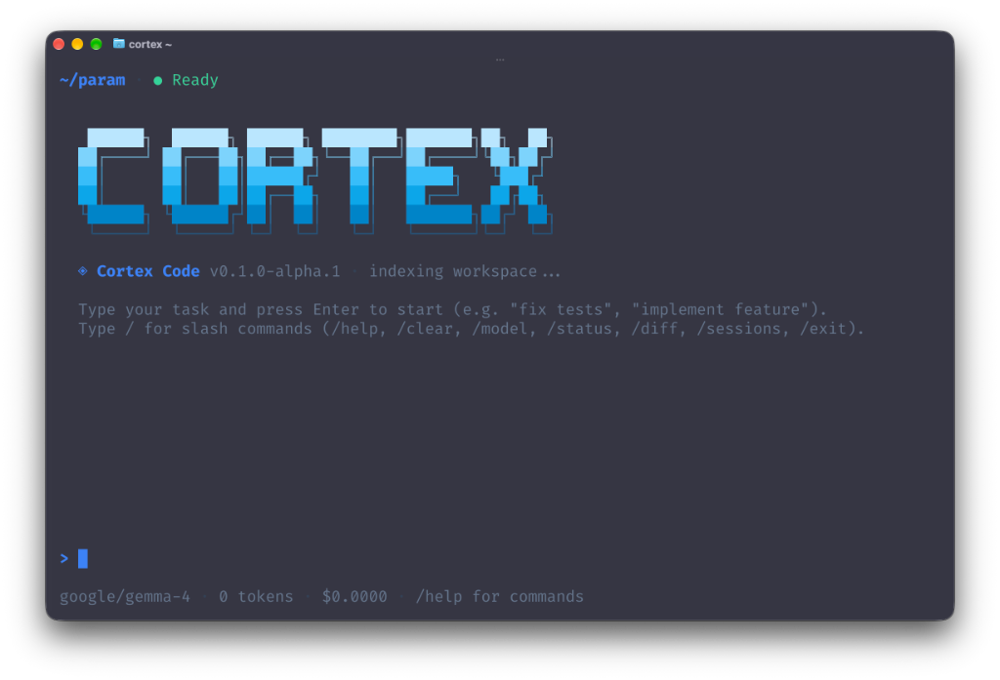

# Cortex

<p align="center">
  <strong>Open-source Rust runtime and terminal harness for autonomous AI workers</strong>
</p>

<p align="center">
  <a href="https://github.com/x1-xh/cortex/blob/main/LICENSE"></a>
  <a href="https://www.rust-lang.org/"></a>
  <a href="https://github.com/x1-xh/cortex/actions"></a>
  <a href="https://cortex-ai.github.io"></a>
</p>

<p align="center">
  
</p>

Cortex is an open-source Rust runtime and terminal harness for autonomous AI workers. It treats model output as untrusted proposal data: the runtime is the sole execution authority, enforcing deterministic workspace boundaries, sanitized environments, and append-only event tracing.

Built natively for **Google Gemma 4**, open local models via Ollama, and frontier providers (Google AI Studio, Anthropic Claude, OpenAI).

---

## Capabilities

<table>
<tr>
  <td width="28%"><b>Terminal Control Plane</b></td>
  <td>Interactive Ratatui TUI with streaming reasoning traces, multiline input, slash-command autocomplete, live diffs, and real-time token and cost telemetry.</td>
</tr>
<tr>
  <td><b>Runtime Authority</b></td>
  <td>Strict execution boundary. Models propose structured JSON tool calls; the runtime validates schemas, canonicalizes paths, scrubs credentials from child processes, and blocks destructive actions (like unauthorized <code>git push</code>).</td>
</tr>
<tr>
  <td><b>Model Agnostic & Gemma 4</b></td>
  <td>Run Google Gemma 4 (<code>gemma4:12b</code>, <code>codegemma</code>) fully offline via Ollama with zero API keys, or connect to Google AI Studio, Anthropic, and OpenAI. Switch models dynamically via <code>/model</code> with zero restart.</td>
</tr>
<tr>
  <td><b>Multi-Agent Coordination</b></td>
  <td>Directed acyclic graph (DAG) execution pipelines, message routing with mailboxes and dead-letter queues, supervisor-worker topologies, and real-time coordination streaming.</td>
</tr>
<tr>
  <td><b>Append-Only Tracing</b></td>
  <td>Every prompt, tool execution, and state change is persisted to SQLite in WAL mode (<code>~/.cortex/cortex.db</code>) with regex secret redaction and bit-exact deterministic replay.</td>
</tr>
<tr>
  <td><b>Model Context Protocol</b></td>
  <td>Native stdio and SSE Model Context Protocol (MCP) client to dynamically discover, register, and query external tools.</td>
</tr>
<tr>
  <td><b>Background Scheduler</b></td>
  <td>Tick-based cron scheduler supporting standard 5-field cron syntax, one-shot timers, and configurable overlap policies (<code>skip</code>, <code>queue</code>, <code>replace</code>).</td>
</tr>
<tr>
  <td><b>Verifiable Benchmarks</b></td>
  <td>Deterministic evaluation harness (<code>cortex bench</code>) to test coding and agent capabilities against reproducible ground truth.</td>
</tr>
</table>

---

## Installation

### Prerequisites

- Rust toolchain $\ge$ 1.75 (`cargo`, `rustc`)
- Git

### Install via Cargo

```bash
# Install globally from GitHub
cargo install --git https://github.com/x1-xh/cortex.git cortex-cli

# Or install from local clone
git clone https://github.com/x1-xh/cortex.git
cd cortex
cargo install --path crates/cortex-cli
```

Ensure Cargo's binary directory is in your `$PATH`:

```bash
export PATH="$HOME/.cargo/bin:$PATH"
```

Verify installation:

```bash
cortex --version
cortex check
cortex status
```

---

## Quickstart

### 1. Interactive Terminal (TUI)

Launch the interactive control plane by running `cortex` in any repository:

```bash
cortex
```

- Type your instructions and press `Enter` to run tasks interactively.
- Press `Tab` or keys `1`–`5` to cycle through views (**Chat**, **Portals**, **Coordination**, **Runs**, **Settings**).
- Type `/` to access built-in slash commands.
- Press `Ctrl+C` to cancel a running task; press `Ctrl+Q` or `/exit` to quit.

### 2. Autonomous Single-Command Execution (`cortex run`)

Run autonomous tasks directly from the command line:

```bash
# Google Gemma 4 (local offline via Ollama, zero API key required)
cortex run "inspect src/main.rs and fix compiler warnings" --model ollama/gemma4:12b

# Google Gemma 4 (hosted via Google AI Studio)
export GEMINI_API_KEY="AIza..."
cortex run "audit repository security" \
  --model gemma-4-26b-it \
  --base-url https://generativelanguage.googleapis.com/v1beta/openai/

# CodeGemma local refactoring
cortex run "refactor error handling to use thiserror" --model ollama/codegemma

# Anthropic Claude / OpenAI
cortex run "implement user authentication module" --model claude-3-5-sonnet-20241022

# Confine to explicit workspace directory
cortex run "cargo clippy --fix" --workspace /path/to/project

# Structured JSON output for CI/CD pipelines
cortex run "verify test suite" --json
```

### 3. Execution History & Deterministic Replay (`cortex runs`)

All execution traces and model completions are logged to SQLite (`~/.cortex/cortex.db`):

```bash
# List recent execution runs
cortex runs list --limit 20

# Inspect full event trace and tool outputs
cortex runs show <run-id> --verbose

# Replay run deterministically using cached model responses
cortex runs replay <run-id>
```

### 4. Deterministic Benchmarking (`cortex bench`)

Evaluate agent performance against ground-truth test suites:

```bash
# Run coding benchmark suite
cortex bench run --suite coding

# Generate Markdown evaluation report
cortex bench run --suite coding --report reports/coding.md --json
```

---

## TUI Slash Commands

| Command | Usage | Description |
|---|---|---|
| `/help` | `/help` | Show command catalog and keyboard shortcuts |
| `/model` | `/model [list \| set <name>]` | Switch active model or list curated providers |
| `/settings` | `/settings [set <key> <val> \| reload]` | View or update `~/.cortex/settings.json` |
| `/status` | `/status` | View runtime health, active model, and storage stats |
| `/diff` | `/diff` | Show Git diff of workspace modifications |
| `/sessions` | `/sessions` | List saved conversation sessions |
| `/resume` | `/resume <id>` | Resume a saved conversation session |
| `/clear` | `/clear` | Clear conversation buffer and auto-save session |
| `/cost` | `/cost` | Display session token usage and cost accounting |

---

## Configuration

Settings are saved in `~/.cortex/settings.json` and can be edited directly or through `/settings`:

```json
{
  "model": "gpt-4o-mini",
  "base_url": null,
  "api_key": null,
  "theme": "blue",
  "max_iterations": 30,
  "auto_save_sessions": true
}
```

Credentials resolve with the following precedence:
1. Command-line flags (`--api-key`, `--base-url`)
2. Environment variables (`CORTEX_API_KEY`, `OPENAI_API_KEY`, `ANTHROPIC_API_KEY`, `GEMINI_API_KEY`)
3. `~/.cortex/settings.json`

---

## Crate Architecture

Cortex is architected as a set of focused, modular Rust crates:

| Crate | Directory | Purpose |
|---|---|---|
| `cortex-core` | [`crates/cortex-core`](crates/cortex-core) | Domain identifiers (`AgentId`, `RunId`), event records, error taxonomy, secret redactor |
| `cortex-runtime` | [`crates/cortex-runtime`](crates/cortex-runtime) | Execution loop, sandbox policies, tool registry, multi-agent bus, SQLite store, MCP manager |
| `cortex-tui` | [`crates/cortex-tui`](crates/cortex-tui) | Ratatui interface, event loop, slash commands, coordination viewer |
| `cortex-cli` | [`crates/cortex-cli`](crates/cortex-cli) | User-facing CLI entrypoint (`cortex`, `run`, `runs`, `bench`) |
| `cortex-harness` | [`crates/cortex-harness`](crates/cortex-harness) | Ground-truth benchmark evaluation runner and baseline providers |

To use Cortex runtime primitives in your own Rust projects:

```toml
[dependencies]
cortex-core = { git = "https://github.com/x1-xh/cortex.git" }
cortex-runtime = { git = "https://github.com/x1-xh/cortex.git" }
cortex-tui = { git = "https://github.com/x1-xh/cortex.git" }
```

---

## Verification & Testing

Every commit satisfies automated static analysis and verification:

```bash
cargo fmt --check
cargo check --workspace --all-targets --all-features
cargo clippy --workspace --all-targets --all-features -- -D warnings
cargo test --workspace --all-targets --all-features
cargo doc --workspace --no-deps --all-features
```

---

## Documentation

Full documentation, architecture guides, and tutorials:

- **Documentation**: [https://cortex-ai.github.io](https://cortex-ai.github.io)
- **Local Guides**: [`docs/`](docs/)

---

## License

Apache License, Version 2.0. See [`LICENSE`](LICENSE) for details.
