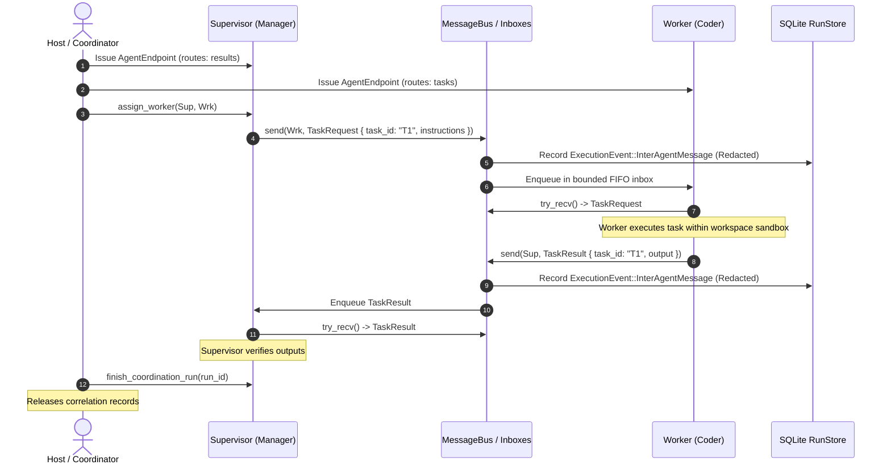

# Multi-Agent Coordination Architecture

Cortex implements an in-process, deterministic multi-agent orchestration architecture designed for structured collaboration among persistent AI workers. 

Per the [Cortex Engineering Contract](../../AGENTS.md), Cortex rejects uncontrolled, emergent swarms in favor of strictly bounded, inspectable, and hierarchical pipelines where **model output is untrusted input** and the **Rust runtime remains the sole execution authority**.

---

## 1. Architectural Principles

1. **Hierarchical Supervision (No Autonomous Swarms)**: Orchestration is deterministic, DAG-bounded, and supervised (e.g. `manager → researcher → coder → reviewer`). Agents may only delegate to assigned workers within an acyclic hierarchy.
2. **Strict Authority Separation**: Inter-agent messages carry typed data payloads. Receiving an envelope never automatically invokes tools or executes code.
3. **Immutable Sender Authentication**: Senders cannot forge identity. Every `AgentEndpoint` strictly stamps the authenticated `AgentId` assigned by the trusted host upon message submission.
4. **No Privilege Elevation**: Task delegation does not copy, expand, or transfer capabilities. A child worker operates exclusively within its own preconfigured permission sandbox.
5. **Deterministic Event Tracing**: All inter-agent message transmissions and lifecycle transitions are recorded in the SQLite `RunStore` event log with automatic secret redaction.

---

## 2. Component Topology

```text
┌────────────────────────────────────────────────────────────────────────┐
│                        Cortex Runtime Engine                           │
│                                                                        │
│   ┌────────────────────┐                 ┌─────────────────────────┐   │
│   │   AgentRegistry    │                 │   WorkflowCoordinator   │   │
│   │                    │                 │                         │   │
│   │ • Role indexing    │                 │ • Manifest parsing      │   │
│   │ • Capability tags  │                 │ • DAG stage sequencing  │   │
│   │ • Peer discovery   │                 │ • Failure & retry loop  │   │
│   └─────────┬──────────┘                 └────────────┬────────────┘   │
│             │                                         │                │
│             ▼                                         ▼                │
│   ┌────────────────────────────────────────────────────────────┐       │
│   │                        AgentManager                        │       │
│   │                                                            │       │
│   │ • Hierarchy validation (acyclic trees)                     │       │
│   │ • Lifecycle management (Running, Paused, Failed, Stopped)  │       │
│   │ • Task correlation tracking (1..=4096 tasks)               │       │
│   └─────────────────────────────┬──────────────────────────────┘       │
│                                 │                                      │
│         ┌───────────────────────┴───────────────────────┐              │
│         ▼                                               ▼              │
│   ┌───────────┐                                   ┌───────────┐        │
│   │ Endpoint  │                                   │ Endpoint  │        │
│   │ (Manager) │                                   │  (Worker) │        │
│   └─────┬─────┘                                   └─────▲─────┘        │
│         │                                               │              │
│         │         ┌───────────────────────────┐         │              │
│         └────────►│        MessageBus         ├─────────┘              │
│                   │                           │                        │
│                   │ • Exact-match routing key │                        │
│                   │ • Bounded FIFO inboxes    │                        │
│                   │ • 64 KiB payload limit    │                        │
│                   │ • Secret redaction trace  │                        │
│                   └───────────────────────────┘                        │
└────────────────────────────────────────────────────────────────────────┘
```

---

## 3. Core Subsystems

### 3.1. AgentRegistry (Discovery & Capabilities)
`AgentRegistry` serves as a concurrency-safe directory for agent descriptors:
- Backed by `Arc<RwLock<HashMap<AgentId, AgentDescriptor>>>`.
- Exposes query APIs: `get(id)`, `find_by_role(role)`, `find_by_capability(cap)`, and `list_active()`.
- Synchronizes with `AgentManager` lifecycle events so stopped or failed agents are immediately reflected.

### 3.2. MessageBus (Bounded Communication Channels)
`MessageBus` coordinates in-process message routing without external broker dependencies:
- **Exact Routing Keys**: Message routing matches explicit ASCII keys (`1..=128` bytes). Wildcards and topic subscriptions are disallowed to guarantee deterministic delivery.
- **Bounded Inboxes**: Inboxes enforce strict capacities (`1..=1024` messages). Saturation triggers backpressure errors rather than memory leaks or silent discards.
- **Payload Bounds**: Message envelopes are capped at 64 KiB of serialized JSON.

### 3.3. Task Correlation & Hierarchy Engine
- **Supervisor-Worker Tree**: Configured via `manager.assign_worker(supervisor, worker)`. Enforces strict tree topologies; cycles, self-assignment, and cross-supervisor interference are rejected.
- **Single-Completion Invariant**: A task ID is unique within a run. Exactly one result (`TaskResult`) or failure (`TaskFailed`) can be returned by the assigned worker.
- **Lifecycle Revocation**: Stopping, failing, or restarting an agent invalidates its endpoint, wakes pending receivers, and marks active delegations inactive.

---

## 4. Sequence Flow: Delegated Task Lifecycle



---

## 5. Formal Envelope Specification

All inter-agent communication uses strongly typed Rust envelopes:

```rust
pub struct AgentMessage {
    pub id: String,
    pub sender: AgentId,
    pub recipient: AgentId,
    pub run_id: RunId,
    pub routing_key: RoutingKey,
    pub timestamp: String,
    pub payload: AgentMessagePayload,
}

pub enum AgentMessagePayload {
    TaskRequest {
        task_id: String,
        instructions: String,
    },
    TaskResult {
        task_id: String,
        output: String,
    },
    TaskFailed {
        task_id: String,
        error: String,
    },
    Notification {
        content: String,
    },
}
```

### Invariants:
1. `id`: Runtime-allocated identifier formatted as `message_<counter>`.
2. `sender`: Immutably attached by the originating `AgentEndpoint`. Cannot be overridden.
3. `timestamp`: RFC 3339 UTC timestamp recorded at enqueue time.
4. `task_id`: `1..=128` bytes; unique across the lifetime of a coordination run.

---

## 6. Failure Recovery & Dead-Letter Handling

1. **Unroutable Destinations**: Attempting to send to an unmapped `AgentId` returns `CortexError::NotFound`.
2. **Inbox Saturation (Backpressure)**: Saturated inboxes reject incoming sends with `CortexError::Validation`. Delegations are not consumed; senders must back off and retry.
3. **Worker Crash**: If an agent fails (`manager.fail(id, reason)`):
   - Its endpoint is revoked and any waiting `.recv().await` futures are woken with an error.
   - Pending delegations are marked non-pending to prevent supervisor deadlock.
   - Senders attempting to contact the failed agent receive errors until the agent is restarted and reconnected with a fresh epoch.
